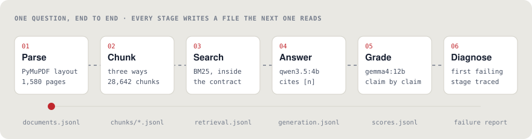

# What 560 graded answers taught me about RAG on real contracts

*The simplest search won, one line of query cleanup beat every model, and the biggest single improvement came from fixing the grader.*

Ask *"Can a party end the Kubient × Associated Press services agreement early without cause, and on what notice?"* and my system answers:

> Yes, either party may terminate the Agreement for any reason following the Initial Term upon ninety (90) days written notice to the other party **[5]**.

That **[5]** points at an exact excerpt on page 1 of the PDF, the same clause a lawyer highlighted when the dataset was made. Getting one answer like that is easy. What I wanted to know was how often it happens, and what goes wrong when it doesn't. So I built the system and an evaluation harness around it, and ran 560 answers through it. These are the notes.

Everything here runs on one laptop (an Apple M4 Pro with 24 GB) with open-weight models and no paid APIs: `qwen3.5:4b` answers, and `gemma4:12b` grades. The code, the committed results and an [animated field guide](https://mazenddr.github.io/Contract-rag/) are on [GitHub](https://github.com/mazenDDr/Contract-rag).

## The setup

**The data.** [CUAD](https://www.atticusprojectai.org/cuad) is 510 commercial contracts filed with the SEC, with over 13,000 lawyer highlights across 41 clause types: governing law, termination for convenience, cap on liability, non-compete and so on. I worked with 100 of them, sampled so each of the 25 contract types keeps its share. That's 1,580 pages.

**The exam.** From the highlights I built 100 questions, each about one named contract:
- 60 about a single clause;
- 15 multi-part, with evidence in two far-apart places;
- 10 numeric;
- 15 **unanswerable**, about clauses the contract doesn't have, to test whether the model admits it.

I split the contracts (not the questions) into 30 dev and 70 test, tuned everything on dev, and reported on test.

**The pipeline.**
1. Parse the PDFs with their layout: headings, tables, pages.
2. Cut the text into chunks.
3. Search.
4. Hand the top 8 excerpts to the model, numbered [1]…[8], with one rule: end every sentence with the excerpt it came from, or say the contract doesn't cover it.

## 1. Measure search on its own, because it's cheap

Search can be scored without any language model: did the lawyer-highlighted clause land in the top 8? So I scored every combination of:
- 3 chunkers;
- BM25 keyword search and 3 embedding models;
- 2 ways of fusing their rankings;
- 2 rerankers;
- searching inside the contract or across all 100.

That's **189 setups in 16 minutes**. Each result carries a bootstrap interval, and every comparison is paired question by question.

The winner was the most boring option on the list: **fixed 512-token chunks and plain BM25, searched inside the contract**. It reached recall@8 0.85 and MRR 0.73 on the test questions.

- **Embeddings alone were clearly worse** (−0.24 MRR). Contracts repeat their own defined terms word for word ("Initial Term", "written notice"), which is exactly what keyword search rewards.
- **Hybrid search tied BM25** (−0.02, not significant). **Rerankers didn't help**: the bge reranker cost about a second per question and *lowered* MRR by 0.15. Inside one contract, a median of 13 chunks, BM25 already has the answer on its shortlist.
- **The biggest win was one line of code.** Questions name their contract ("…the Master Services Agreement between Kubient Inc. and The Associated Press…"). Inside that contract, the name only matches the title page and the signature block, which then outrank the actual clause. Replacing the name with "the agreement" raised MRR by **+0.40**, more than any model did.

The lesson I'd pass on: before adding a component, check what your queries actually contain.

## 2. Where you cut the text is a trade-off, not a setting

Fixed chunks won search: recall@8 0.85, against 0.74 for sections and 0.58 for single sentences. But when I looked at the answers, **smaller chunks gave more faithful answers**: 0.83–0.87 of statements supported by their citations, against 0.62 for fixed chunks. A 512-token excerpt holds several provisions, and a 4B model sometimes merges them. Neither is simply better. The right cut depends on whether you're short of recall or of faithfulness.

## 3. Grade statements, not answers, and check the grader before trusting it

A single "rate this answer from 1 to 10" hides *which* sentence is wrong. So the grading is split into small, checkable steps:
1. **Split in code.** The answer is cut into statements, each with the citations that follow it.
2. **Check each statement against only the excerpts it cites.** A statement can't be "supported" by an excerpt it didn't cite.
3. **Check numbers in code.** Every figure in a statement (days, amounts, dates) has to appear in its cited excerpts. Small graders let "60 days" slide past for "90 days"; a string check doesn't.
4. **Grade correctness** against the lawyers' reference in a separate call.

That split catches answers like this one: correct overall, but its first sentence cites the preamble, which says nothing about assignment. It gets correctness 1.0 and faithfulness 0.5, which is exactly the kind of thing a single score hides.

Then I graded the grader. 30 answers were generated from a controlled context and compared with 24 labels written blind, using Cohen's κ (agreement beyond chance). The correctness rubric I started the full run with reached κ 0.48. A "list the key facts, then check each one" rubric *looked* more rigorous but only reached **κ 0.18**. It lost the answer's yes/no conclusion, it missed wrong details inside a fact, and its fact lists changed from run to run. The rubric I kept, *contradiction-only*, reached **κ 0.60**. The lesson: a grading method that looks more careful isn't better until it agrees with people.

## 4. The grader was part of the problem

The first full run graded 282 of 560 answers as not fully correct. I read the 20 worst cases by hand and found that the grader was often wrong:
- **58%** of its negative grades faulted details "not in the provided clause". Those details were usually true, just stated elsewhere in the contract.
- Its abstention score mostly read a JSON flag. Many answers said "the contract doesn't specify…" with the flag left off, and were counted as guesses.

I fixed both rules and validated the fix against the labels before adopting it. Then I regraded **the same 560 answers**. Failures dropped from 282 to **185**, and mean correctness rose from 0.59 to **0.71**, without changing a single answer. If I had "improved the model" at that point, I would have been tuning against a broken ruler.

## 5. Most failures happen before the model reads anything

Because every stage saves its ranked list, each failure can be traced to the **first** stage that went wrong. Did the evidence make it into a chunk? Did search rank it? Did it reach the model? Did the model use it correctly?

**62% of the remaining failures happen in retrieval.** The model never saw all the evidence. Two patterns explain most of them:
- **Multi-part questions.** "Exclusivity *and* non-compete" searches as one query, and one half dominates. Partial evidence caused 40 of the 53 multi-part failures.
- **Vocabulary gaps.** "Can it end early without cause?" meets "Shipper decides to terminate … prior to the commencement of transportation service", with almost no words shared. Across all rows, the evidence that reached the model shared 34% of the question's content words; the evidence that was missed shared 12%.

The model's own mistakes are real but fewer (58 answers). It swaps who holds a right ("XIMAGE will give title" became "XIMAGE retains ownership"), cites the wrong excerpt number for a correct fact, or fills in a missing duration with a number from another excerpt.

## 6. Deploying reality-checked the model choice

To put a demo online without a GPU, I timed one real question on 2 CPU threads: **164 s** for the 4B model, **48 s** for the 2B. The 2B was tempting, so I ran it through the same evaluation. Correctness fell from 0.75 to **0.53**, and citation validity from 0.87 to **0.14**: it left the citations out of 52 of 70 answers. A fast answer without its source isn't what this project is for, so the 4B stayed.

Then free Docker hosting on Hugging Face moved behind a paid plan. The live system now runs anywhere with one `docker run`, and the public demo [replays the recorded answers](https://mazenddr.github.io/Contract-rag/demo/): every test question, graded and cited, with the failures and their causes included.

## What I'd do next

The failure analysis gives the order:
1. **Split multi-part questions** into sub-searches and merge the results. This targets the largest failure group.
2. **Rewrite queries into the contract's vocabulary** before searching.
3. **Verify each citation after generation**, and reject statements whose excerpt doesn't support them.
4. **Search across contracts.** Once questions don't name their contract, BM25 recall@8 falls from 0.85 to 0.49, and embeddings, metadata filters and rerankers should start to pay for themselves. The same harness can measure that.

## Takeaways

- **Score retrieval on its own first.** It's cheap, and it's where most of the failures were.
- **Read what your queries actually contain.** One cleanup line beat every model.
- **Grade claim by claim, check numbers in code, and publish your grader's agreement** with human labels.
- **Before you improve the model, make sure the grader isn't the problem.**
- **Save every intermediate result.** It turns "why did this fail?" from an argument into a lookup.

---

*Code, results and write-ups: [github.com/mazenDDr/Contract-rag](https://github.com/mazenDDr/Contract-rag) · The field guide, with an animation of every stage: [mazenddr.github.io/Contract-rag](https://mazenddr.github.io/Contract-rag/) · Recorded answers: [/demo](https://mazenddr.github.io/Contract-rag/demo/). Data: CUAD v1 by The Atticus Project, CC BY 4.0.*
